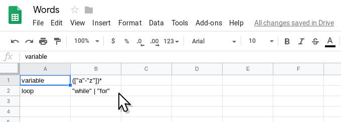
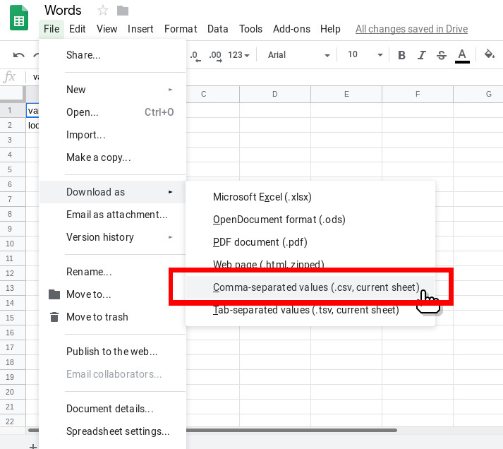

# JavaCCC
A set of tools for Java Compiler Compiler™ (JavaCC™) made in python.

# Requitements
These requirements are necessary for the project so please make sure to have them installed on your machine.
* [Python 3](https://www.python.org/downloads/)
* [Graphviz](http://www.graphviz.org/)

# Getting started
Run `python src -h` to get help.
```
$ python src -h
usage: src [-h] [-i INPUT_FILE] [-o OUTPUT_DIR] [--optimize] [-s SIZE]

A set of tools for Java Compiler Compiler™ (JavaCC™) made in python.

optional arguments:
  -h, --help            show this help message and exit
  -i INPUT_FILE, --input-file INPUT_FILE
                        an input csv file
  -o OUTPUT_DIR, --output-dir OUTPUT_DIR
                        an output directory
  --optimize            optimize automatas (WARNING the optimization process will take A LONG TIME)
  -s SIZE, --size SIZE  image size (default 10)
```

This project requires a CSV file with the name of the token as the first field and the regular expression as the second field. This CSV file can easily be generated in excel or google sheets, just like this:




After this you can use the command `python src -i INPUT_FILE -o OUTPUT_DIRECTORY`:
```shell
# run command
python src -i Words.csv -o output
```

The images should be generated in the `output` directory.

You can optimize the automatas but it may take a LONG TIME.
```shell
# run command with optimization
python src -i Words.csv -o output --optimize
```

You can also change the size of the automatas.
```shell
# run command with different size
python src -i Words.csv -o output -s 40
```
