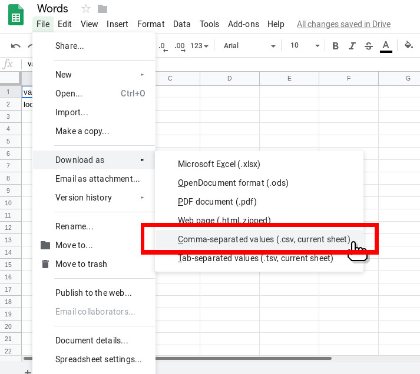

# Tokens Java Compiler Compiler™ (JavaCC™) Generator

The token generator for JavaCC is an algorithm written in Python to give the information, get the tokens that we need for our lexical analyzer [.jj file].

## For its use

This project requires a CSV file with the name of the token as the first field and regular expression for the lexeme as the second field. This CSV file can easily be generated in excel or google sheets, just like this:




After this you can use the command `python tokens-javacc-generator.py`:
```shell
# run command
python tokens-javacc-generator.py
```

You must provide the path of your .csv file, and then click enter.

The tokens should be generated in the console, copy-paste on your .jj file.